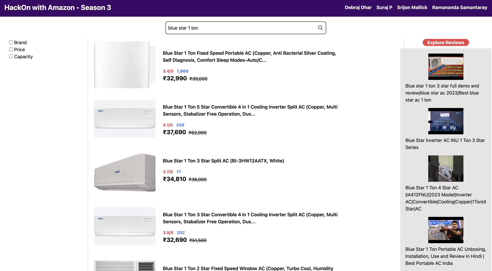
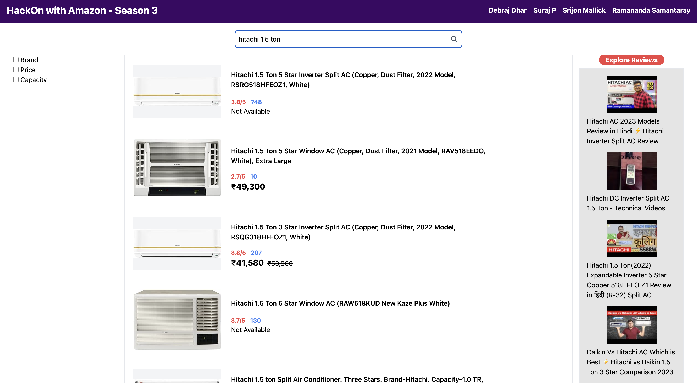

# HackOn with Amazon - Season 3 Project

## Amazon-GPT-Search

-- **Dataset Used:** `https://www.kaggle.com/datasets/lokeshparab/amazon-products-dataset?select=All+Books.csv` (Air Conditioners.csv file)

### 1. Git Clone the repo to your local directory -

```bash
  git clone https://github.com/Debraj550/Amazon-GPT-Search.git
```

### 2. Setup and Start Client (Default port: 3000) 🚀-

```bash
    cd client/
    npm install
    npm start
```

### 3. Setup and Start server (Default port: 8000) 🚀-

```bash
    cd server/
    pip install uvicorn fastapi pymongo dotenv google-api-python-client openai
    uvicorn main:app --reload
```

### 4. Sample Prototype -



